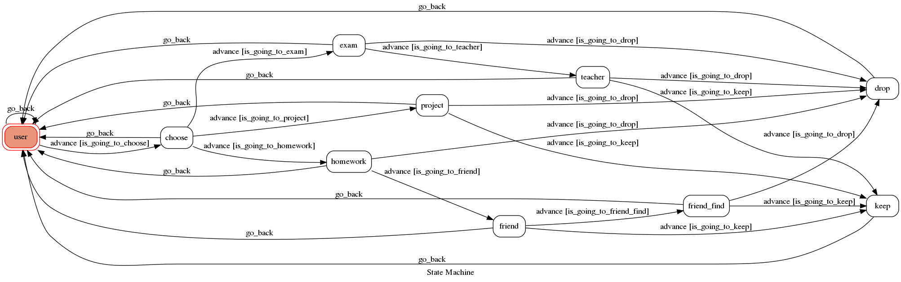

# TOC Project 2020

[](https://codeclimate.com/github/NCKU-CCS/TOC-Project-2020/maintainability)

[](https://snyk.io/test/github/NCKU-CCS/TOC-Project-2020)


Template Code for TOC Project 2020

A Line bot based on a finite state machine

More details in the [Slides](https://hackmd.io/@TTW/ToC-2019-Project#) and [FAQ](https://hackmd.io/s/B1Xw7E8kN)

## Setup

### Prerequisite
* Python 3.6
* Pipenv
* Facebook Page and App
* HTTPS Server

#### Install Dependency
```sh
pip3 install pipenv

pipenv --three

pipenv install

pipenv shell
```

* pygraphviz (For visualizing Finite State Machine)
    * [Setup pygraphviz on Ubuntu](http://www.jianshu.com/p/a3da7ecc5303)
	* [Note: macOS Install error](https://github.com/pygraphviz/pygraphviz/issues/100)


#### Secret Data
You should generate a `.env` file to set Environment Variables refer to our `.env.sample`.
`LINE_CHANNEL_SECRET` and `LINE_CHANNEL_ACCESS_TOKEN` **MUST** be set to proper values.
Otherwise, you might not be able to run your code.

#### Run Locally
You can either setup https server or using `ngrok` as a proxy.

#### a. Ngrok installation
* [ macOS, Windows, Linux](https://ngrok.com/download)

or you can use Homebrew (MAC)
```sh
brew cask install ngrok
```

**`ngrok` would be used in the following instruction**

```sh
ngrok http 8000
```

After that, `ngrok` would generate a https URL.

#### Run the sever

```sh
python3 app.py
```

#### b. Servo

Or You can use [servo](http://serveo.net/) to expose local servers to the internet.


## Finite State Machine


## Usage
The initial state is set to `user`.

* State: user
	* Input: "start"
		* State: choose
		* Reply: "你爲什麽要退選呢？"
		* Reply: 1.期中考考太爛 2.作業太難寫了 3.分組報告完全不會做
		 	* Input: 選擇"期中考考太爛"
				* State: exam
				* Reply: "其他人考得怎麽樣呢？"
				* Reply: 1.大家都一樣爛 2.只有我這麽爛
					* Input: 選擇"大家都一樣爛"
						* State: teacher
						* Reply: "該科教授看起來友善嗎？"
						* Reply: 1.超和藹可親的 2.看起來就是大刀教授
			* Input: 選擇"作業太難寫了"
				* State: homework
				* Reply: "可不可以‘參考’別人的作業呢？"
				* Reply: 1.作業可以偷偷抄 2.助教抓抄襲超嚴格的
					* Input: 選擇"作業可以偷偷抄"
						* State: friend
						* Reply: "有沒有認識系上卷哥卷姐？"
						* Reply: 1.有 2.沒有我超邊緣
							* Input: 選擇"沒有我超邊緣"
								* State: friend_find
								* Reply: 如何交朋友教程
								* Reply: 看完教程後，有信心和卷哥卷姐成爲朋友嗎嗎？
								* Reply: 1.現在全系都是我朋友 2.不行我辦不到
			* Input: 選擇"分組報告完全不會做"
				* State: project
				* Reply: "其他隊員怎麽樣呢"
				* Reply: 1.全部和我一樣廢 2.隊内有超神卷哥卷姐
					* Input: 選擇 全部和我一樣廢 不行我辦不到 助教抓抄襲超嚴格的 只有我這麽爛 看起來就是大刀教授
						* State: drop
						* Reply: "快退吧！你沒救了！"
					* Input: 選擇 隊内有超神卷哥卷姐 有 現在全系都是我朋友 超和藹可親的
						* State: keep
						* Reply: "別退！教授和同學會拯救你的！"
